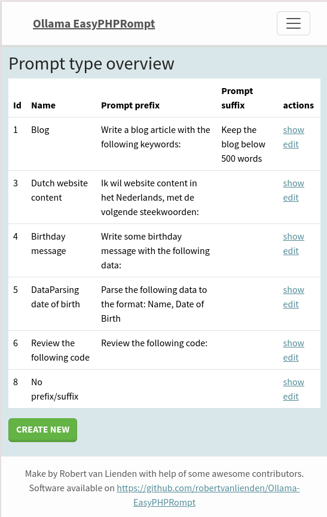

# Ollama EasyPHPRompt
## Warning; Just some quick-and-dirty POC! Don't expect nice and shiny things! I just hack around to create some cool stuff with ollama here :)
This is a test project for Ollama, using it locally as an LLM (Large Language Model). With this project, you can easily reuse and manage "Prompt Types" to streamline your requests. You can also use these prompt types with your own API integrations.

All created request are getting picked up async with Symfony Message and the Doctrine driver.

## Features
- Pre-define customizable prompt prefixes/suffixes for efficient reuse in various tasks.
- Add new data-based requests using the pre-defined prompts for improved workflow.
- An accessible API (documented at http://localhost:82/api) built with API Platform that allows you to create requests through your own application or website.
- Can be used with the following chrome extension: [robertvanlienden/Ollama-EasyPHPRompt-chrome-extension](https://github.com/robertvanlienden/Ollama-EasyPHPRompt-chrome-extension)

## Screenshots
### Prompt overview

### Prompt creation

### Generated prompt

## Requirements
- [Docker](https://www.docker.com/)

## How to use
### Docker 
Install Docker on your machine (if not already installed).

### Setup project
1. `./Taskfile init` (you may need to do this 2 times, too lazy to fix migrations for both worker and PHP container...)
2. Download the `llama3` model by running `./Taskfile ollama-pull llama3` (or your own model, you can switch to your favorite model in the `.env`)
3. Add some prompts to http://localhost:82/prompt/type/
   a. Example; **Name:** `Blog`. **Prompt Prefix:** `Write a blog article with the following keywords:`
4. http://localhost:82/ => Add some ollama_request with the prompt type you just created
5. http://localhost:82/ollama/request/ to view your request. Output is available when processed by the queue.

Run `./Taskfile` for a complete list of `Taskfile` commands.

## Example uses
### Generating Blog Articles
- Add a `Prompt Type` with the following PromptPrefix: `Write a blog article with the following keywords:`
- Use this Prompt Type on http://localhost:82/ and fill in the `data` with keywords for your prompt

### Parse datasets
- Add a `Prompt Type` with the following PromptPrefix: `Parse the following data to the format: Name, Date of Birth`
- Use this Prompt Type on http://localhost:82/ and fill in the `data` with information you have.

## Donations
Want to support me creating stuff like this? Consider donating with [PayPal](https://www.paypal.me/robertvanlienden).